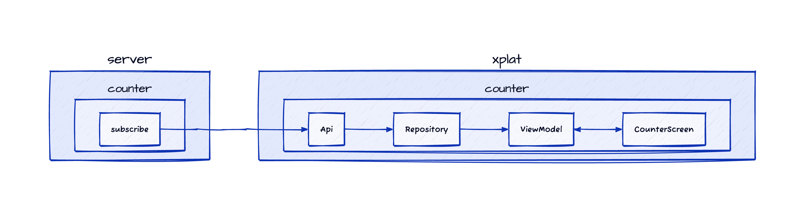

# Forester

A Kotlin library for mapping out the forest.


## Problem

It's crucial to have a comprehensive understanding of a system's architecture. Architecture diagrams offer valuable visual representations of the system's structure and its components. However, as a codebase evolves and its architecture adapts, maintaining synchronization between the code and diagrams can become increasingly challenging. Outdated diagrams can result in miscommunication, misconceptions about the system, and ultimately, increased development and maintenance costs.

## Solution

Forester keeps code and diagrams aligned:

- **Automatic generation.** Forester parses your code and generates architecture diagrams based on your code's
  structure and annotations.
- **Version control.** Store your architecture diagrams alongside your code in the same version control system.
- **Continuous integration.** Integrate Forester into your CI pipeline to generate and update diagrams automatically
   whenever significant code changes are made.
- **Collaboration.** Promote a culture of shared responsibility for keeping architecture diagrams current among your
   engineering team.

## Installation

```shell
plugins {
  id("com.dropbox.forester.plugin")
}

implementation("com.dropbox.forester:forester:0.1.0")

forester {
  outputDir = "docs/forester"
}
```

## Sample


```kotlin
@ForesterExport
class Forester {

    @Forester
    fun map() = forester {
        node("server.counter.subscribe")
        node(Api::class)
        node(Repository::class)
        node(ViewModel::class)
        node("xplat.counter.CounterScreen")

        directed("server.counter.subscribe", Api::class)
        directed(Api::class, Repository::class)
        directed(Repository::class, ViewModel::class)
        undirected(ViewModel::class, CounterScreen)
    }
}

```


